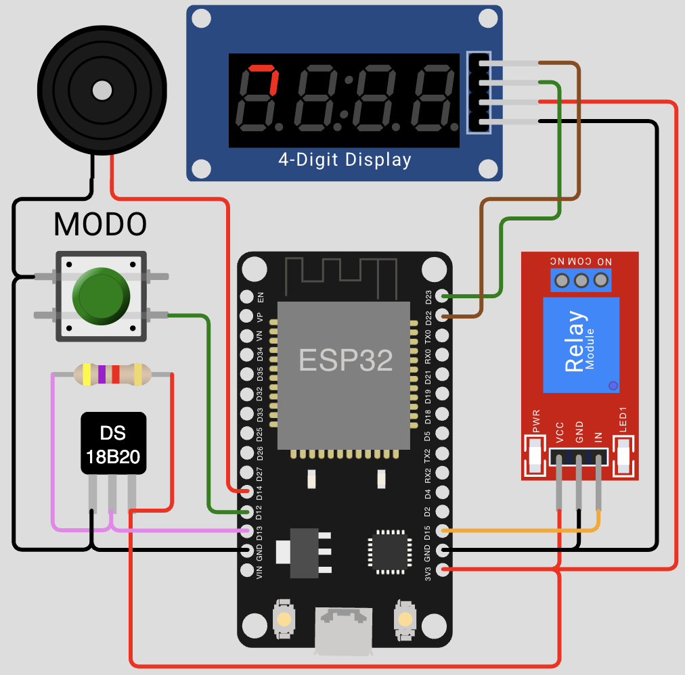

# Pavatech

Proyecto de control eléctronico de una pava eléctrica, para la materia Proyecto y Diseño electrónico de 7° año, del Instituto Don Orione (ciclo lectivo 2025).

Utiliza un ESP32, un sensor de temperatura DS18B20, un display de 4 digitos (basado en TM1637), un buzzer para notificación sonora, y un relé para activar la resistencia de calentemiento. También incluye una interfaz web sencilla que muestra la temperatura y el estado de la pava, en tiempo real.


## Compilación

En Visual Studio Code, abrir la CLI de [PlatformIO](https://docs.platformio.org/en/latest/core/installation/index.html), y luego ejecutar el comando:

```
pio run
```

## Simulación

Se utiliza [Wokwi para Visual Studio Code](https://marketplace.visualstudio.com/items?itemName=wokwi.wokwi-vscode) para la simulación.

En Visual Studio Code, presionar **F1** y elegir "Wokwi: Start Simulator".

Una vez que la simulación esté corriendo, abrir http://localhost:8180 en una solapa del navegador para interactuar con la interfaz web.